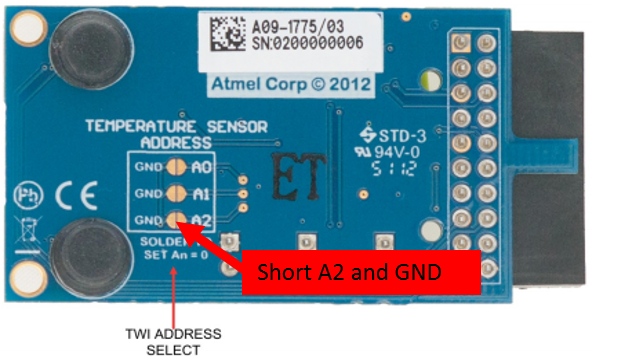
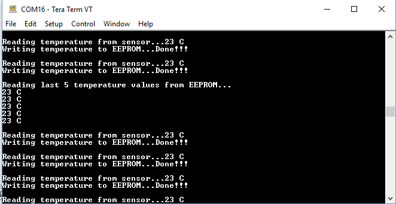

# I2C driver synchronous - multi slave

This example application demonstrates the multi-client feature of the synchronous mode of the I2C driver by communicating with an external EEPROM and a temperature sensor.

## Description

This example uses the I2C driver in asynchronous mode and demonstrates the multi-client feature. The example uses a [IO1 Xplained Pro Extension Kit](https://www.microchip.com/developmenttools/ProductDetails/ATIO1-XPRO) that has a temperature sensor and an EEPROM, both interfaced on the same I2C bus.

Two application tasks are created which act as clients to the same instance of the I2C driver:

APP_I2C_TEMP_SENSOR_Tasks:

Reads temperature every 1 second, prints on console and notifies the EEPROM client. The Time System Service is used to generate a callback every 1 second

APP_I2C_EEPROM_Tasks:

Writes temperature values to the EEPROM once the temperature read complete notification is received. The task also reads and prints the last five saved temperature data from the EEPROM when user enters any key on the console.

## Downloading and building the application

To clone or download this application from Github, go to the [main page of this repository](https://github.com/Microchip-MPLAB-Harmony/core_apps_sam_d5x_e5x) and then click Clone button to clone this repository or download as zip file.
This content can also be downloaded using content manager by following these [instructions](https://github.com/Microchip-MPLAB-Harmony/contentmanager/wiki).

Path of the application within the repository is **apps/driver/i2c/sync/i2c_multi_slave/firmware** .

To build the application, refer to the following table and open the project using its IDE.

| Project Name      | Description                                    |
| ----------------- | ---------------------------------------------- |
| sam_e54_xpro_freertos.X | MPLABX project for [SAM E54 Xplained Pro Evaluation Kit](https://www.microchip.com/developmenttools/ProductDetails/atsame54-xpro) |
|||

## Setting up the hardware

The following table shows the target hardware for the application projects.

| Project Name| Board|
|:---------|:---------:|
| sam_e54_xpro_freertos.X | [SAM E54 Xplained Pro Evaluation Kit](https://www.microchip.com/developmenttools/ProductDetails/atsame54-xpro) |
|||

- To run the demo, the following additional hardware are required:
  - [IO1 Xplained Pro Extension Kit](https://www.microchip.com/developmenttools/ProductDetails/ATIO1-XPRO)

  - The A2 address line of TWI must be soldered to GND. This is done to modify the address of the the EEPROM on IO1 Xplained Pro Extension Kit. The modification changes the address of the temperature sensor to 0x4B and the EEPROM to 0x50

    

### Setting up [SAM E54 Xplained Pro Evaluation Kit](https://www.microchip.com/developmenttools/ProductDetails/atsame54-xpro)

- Connect the [IO1 Xplained Pro Extension Kit](https://www.microchip.com/developmenttools/ProductDetails/ATIO1-XPRO) to the EXT2 header
- Connect the Debug USB port on the board to the computer using a micro USB cable

## Running the Application

1. Open the Terminal application (Ex.:Tera term) on the computer.
2. Connect to the EDBG/Jlink Virtual COM port and configure the serial settings as follows:
    - Baud : 115200
    - Data : 8 Bits
    - Parity : None
    - Stop : 1 Bit
    - Flow Control : None
3. Build the application using its IDE
4. Observe the temperature values getting printed on the terminal application every 1 second and temperature value written into EEPROM notification as shown below
5. Press any key on the terminal, last 5 temperature values will be read from the EEPROM and displayed as shown below

    
